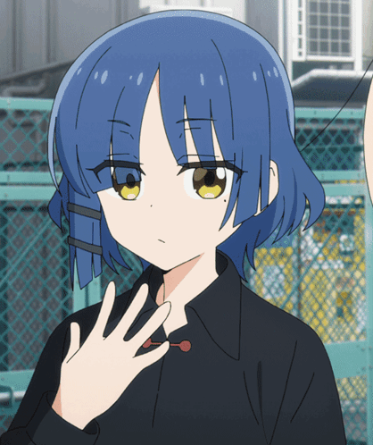

#   About me (EN)

 
<h1> Life:</h1>

 I am 17yo and got interest in computers since 2020.  
 I am an <a href="https://fr.wikipedia.org/wiki/Baccalaur%C3%A9at_sciences_et_technologies_de_l%27industrie_et_du_d%C3%A9veloppement_durable">STI2D</a> S.I.N student in highschool in France.  
 I mostly make programs for <a href="https://en.wikipedia.org/wiki/Microcontroller">microcontrollers</a>.  
 In my free time I enjoy drawing, cooking, playing bass and <a href="assets/hobbylist.md">much more</a>.  
 I love listening to music, <a href="https://anilist.co/user/Ryouuuo/">read or watch anime</a>.  
I am mostly known on social medias as Ryou.  
I try to do everything by myself without using LLMs,   if my code is not optimised or has problem please report it to me!  

---
 
<h1> Computer specs:</h1>

   PSU: <a href="https://www.bequiet.com/fr/powersupply/5906"> BEQUIET! SYSTEM POWER 11 750 W </a> 
   RAM: 32gb DDR4 2667MHz (no name)  
   Graphic card: <a href="https://www.msi.com/Graphics-Card/GeForce-RTX-3060-VENTUS-2X-12G-OC">RTX 3060 12GB STRIXX</a>  
   Motherboard: <a href="https://fr.msi.com/Motherboard/B360M-MORTAR/Specification">MSI B360M MORTAR</a> 
   CPU: <a href="https://www.intel.fr/content/www/fr/fr/products/sku/190884/intel-core-i59600kf-processor-9m-cache-up-to-4-60-ghz/specifications.html">Intel i5-9600KF 6 Cores</a>   
   as well as a Chinese 2.5gb Ethernet card

    

---

 
<h1> What I use: </h1>

Programming (in general): <a href="https://code.visualstudio.com/"> VS Code </a> 
Video Games: <a href="https://unity.com/">Unity</a>, <a href="https://github.com/godotengine/godot"> Godot</a>.  
Softwares: Godot.  
HID and microcontrollers: <a href="https://github.com/arduino/arduino-ide"> Arduino IDE</a>.  
Assets: <a href="https://github.com/blender/blender">Blender</a>, <a href="https://github.com/LibreSprite/LibreSprite">Libresprite</a>, Photoshop

---

 

<h3 align=center>
Thanks for reading my about me    </h3>

<h5 align=center>
Contact: <a href="mailto:ryoucafe@icloud.com">ryoucafe@icloud.com</a>   </h3>

